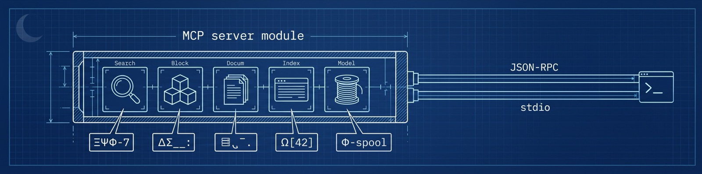
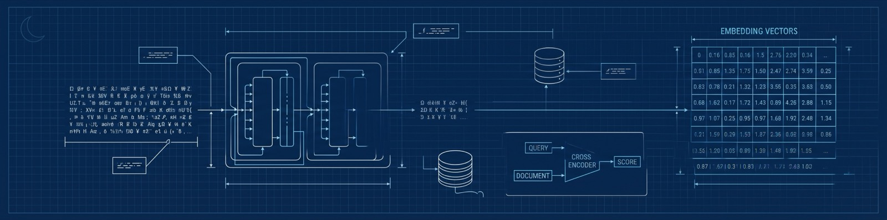
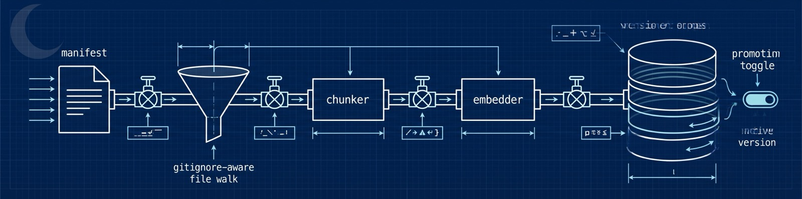
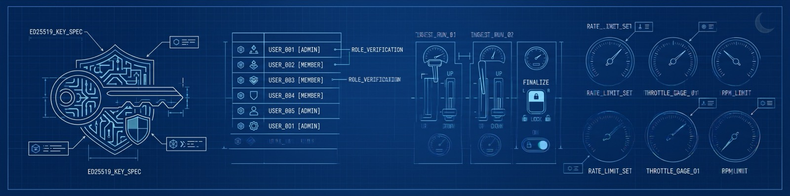

<p align="center">
  
</p>

<h1 align="center">midnight-manual</h1>

<p align="center">
  <strong>A privacy-respecting retrieval engine for the <a href="https://midnight.network">Midnight Network</a> — purpose-built so your AI assistant answers from the <em>real</em> docs and source, not from a stale training set.</strong>
</p>

<p align="center">
  
  
  
  
  
  
</p>

`midnight-manual` is one Cargo workspace that ships three things that work together:

- **`mnm` — a local MCP server.** Drop it into Claude Code, Codex, Cursor, or any MCP client and your assistant gains hybrid semantic search over the Midnight corpus, with reranking, source-aware confidence scoring, and document navigation.
- **`mnm` — a developer & admin CLI.** Search the corpus from your terminal, inspect chunks and documents, check the active embedding model, and (for maintainers) run the whole ingestion pipeline.
- **`midnight-manual-server` — the cloud corpus.** An `axum` service backed by PostgreSQL + pgvector that hosts the indexed corpus and the search API. A hosted instance lives at **`https://midnight-manual.midnightntwrk.expert`** and is the compiled-in default — most users never run the server themselves.

> [!WARNING]
> **`midnight-manual` is pre-production.** The hosted corpus is reset frequently and without notice, the database may be wiped between deploys, search results and ingested content can disappear, and **interfaces may change at any time** — the MCP tool contract, CLI flags, HTTP routes, config keys, and the manifest format are all still moving. Do not build anything load-bearing on top of it yet. Pin to a release and expect breakage on `main`.

---

## Table of contents

- [Quick start](#quick-start)
- [The MCP server](#the-mcp-server)
- [Advanced search skills](#advanced-search-skills)
- [Rate limits and uplift](#rate-limits-and-uplift)
- [The CLI](#the-cli)
- [Models](#models)
- [The smart chunker](#the-smart-chunker)
- [The ingestion pipeline](#the-ingestion-pipeline)
- [Admin & operations](#admin--operations)
- [The cloud server](#the-cloud-server)
- [Telemetry & privacy](#telemetry--privacy)
- [Embeddings & third-party processing](#embeddings--third-party-processing)
- [Configuration](#configuration)
- [Deep dives](#deep-dives)
- [Project links](#project-links)

---


## Quick start

The corpus is hosted, and both embedding and reranking run through VoyageAI (proxied by the hosted server) — **no model is fetched to your machine**. There is **no database, no API key, and no account** required to search.

> **Prebuilt binaries & Homebrew.** Each tagged release ships `cargo-dist` shell/PowerShell installers (SHA256-verified) for macOS, Linux (gnu + musl), and Windows across [the Releases page](https://github.com/devrelaicom/midnight-manual/releases), plus a Homebrew tap:
>
> ```bash
> brew install midnight-network/tap/midnight-manual   # installs both `midnight-manual` and `mnm`
> ```
>
> Building from source (below) needs only a [Rust toolchain](https://rustup.rs) (1.91+).

### 1. Build the CLI from source

```bash
git clone https://github.com/devrelaicom/midnight-manual.git
cd midnight-manual
cargo build --release -p midnight-manual
```

This produces two identical binaries, `midnight-manual` and its short alias `mnm`, in `target/release/`. Put one on your `PATH`:

```bash
install -m 0755 target/release/mnm ~/.local/bin/mnm   # or anywhere on $PATH
mnm doctor                                            # verify reachability + rerank config
```

`mnm doctor` checks that the cloud corpus is reachable, reports your reranking configuration, and flags anything misconfigured.

### 2. Search straight away

```bash
mnm search "how do I write a Compact contract with a sealed ledger?"
```

`mnm search` returns ranked, source-attributed results straight away — each with a **confidence score** and a one-line provenance breakdown. Both embedding and reranking run through VoyageAI (proxied by the hosted server, so no key is needed) — there is no local model to download. Reranking is **on by default** (VoyageAI `rerank-2.5`); pass `--rerank off` for lowest latency, or `--rerank local` to rerank with your own `VOYAGE_API_KEY`.

### 3. Install the MCP server into your AI client

`mnm mcp serve` speaks MCP (JSON-RPC 2.0) over stdio. Point any MCP-capable assistant at it.

<details open>
<summary><strong>Claude Code</strong></summary>

```bash
claude mcp add midnight-manual -- mnm mcp serve
```

…or add it by hand to your MCP config:

```json
{
  "mcpServers": {
    "midnight-manual": {
      "command": "mnm",
      "args": ["mcp", "serve"]
    }
  }
}
```
</details>

<details>
<summary><strong>Codex</strong></summary>

Add to `~/.codex/config.toml`:

```toml
[mcp_servers.midnight-manual]
command = "mnm"
args = ["mcp", "serve"]
```
</details>

<details>
<summary><strong>Cursor</strong></summary>

Add to `~/.cursor/mcp.json` (global) or `.cursor/mcp.json` (per-project):

```json
{
  "mcpServers": {
    "midnight-manual": {
      "command": "mnm",
      "args": ["mcp", "serve"]
    }
  }
}
```
</details>

> Prefer it scripted? `mnm mcp install --agent claude-code` (also `--agent cursor`, `--agent continue`) writes the config for you.

Restart your client and ask it something Midnight-specific. It will reach for the `search` tool, pull back grounded passages, and cite the source it used.

---



## The MCP server

`mnm mcp serve` is a hand-rolled MCP server (JSON-RPC 2.0 framed over stdio) — it starts in well under half a second with no local models to load (both embedding and reranking are remote VoyageAI calls), so adding it to your client costs you nothing at idle.

It exposes **13 tools**, grouped by what they do:

### Search

| Tool | What it does |
| --- | --- |
| **`search`** | The simple surface: hybrid full-text + vector retrieval from a single `query` (switch `mode` to `fts` or `vector` to pin one half). `limit` defaults to 10, capped at 50. Optional `code_mode` (`on`/`off`/`exclusive`) folds in the `voyage-code-3` code vector. Every hit carries a confidence score and per-factor trust breakdown. |
| **`advanced_search`** | Full-control retrieval: fuses 1–10 `queries` via RRF (HyDE / expansion / step-back), restricts by per-facet `filters` (source, attribution tier, language, package, version target, …), switches `mode` and `code_mode`, toggles VoyageAI `rerank` (on by default), accepts `rerank_instructions` (≤400 chars), and sets `version_match` (`permissive` default / `strict`). Call `facets` first to discover valid filter values. |

### Read a hit in context

A search result is a chunk. These tools let your assistant pull exactly as much surrounding context as it needs — no more, no less — instead of dumping whole files into the window:

| Tool | What it does |
| --- | --- |
| **`get_chunks`** | Fetch the full content of 1–20 chunks by id in one batched call — the way to read the actual text behind search results. |
| **`get_chunk_next`** / **`get_chunk_prev`** | Walk forward/backward `count` chunks (default 5, max 100). Skips `embed_failed` gaps. |
| **`get_chunk_neighbors`** | Fetch a chunk plus `count` neighbours on each side (default 2, max 100) — `prev` + the chunk + `next` — in one round-trip. |
| **`get_chunk_parents`** | Walk the parent chain up to the source-version root — great for "where does this live?". |
| **`get_document`** | Document metadata + an ordered skeleton of its chunks (`{id, chunk_index, token_count}` — no bodies). Size a document up before reading it with `get_document_chunks`. |
| **`get_document_chunks`** | A windowed slice of a document's chunk bodies with `from` / `limit` pagination. |

### Corpus & diagnostics

| Tool | What it does |
| --- | --- |
| **`list_sources`** | Enumerate corpus sources (paginated; filter by kind, created window, retired) — slug, display name, kind, active revision. The slugs feed `advanced_search` filters. |
| **`facets`** | Discover the filter dimensions `advanced_search` accepts and the values present in the corpus — call it bare for the overview, `facet=` to drill one open-set facet (`source_slug`, `language`, `tags`, `package`, `language_target`, `sdk_dependency`), and `within=` for the second drill level (the version values within a name). |
| **`status`** | Diagnose the retrieval setup: cloud reachability, auth state, both limit families (request rate + token budget), VoyageAI key validity, and rerank configuration. Call it when searches misbehave. |
| **`install_search_skill`** | Install/update the `midnight-advanced-search` skill (`SKILL.md`) into your detected AI harness(es); reports the paths written and the per-harness reload step. The only non-read-only tool. |

### Why it's good

- **Hybrid retrieval, not just vectors.** Lexical (PostgreSQL full-text) and semantic (pgvector) results are fused with [Reciprocal Rank Fusion](#deep-dives) so exact-term matches and conceptual matches both surface.
- **VoyageAI reranking.** `advanced_search` re-scores the candidate set with VoyageAI's reranker (`rerank-2.5` by default — see [Models](#models)) for precision on hard queries. It's on by default; set `rerank: false` for lowest latency. On any rerank failure the server **degrades to RRF order and flags why** (a closed-set reason) rather than failing the search.
- **Confidence you can reason about.** Each result blends a **trust score** (source attribution, verification, freshness, deprecation, version-match) with relevance — and returns the factor breakdown so your assistant can say *why* a passage is trustworthy without another round-trip.
- **Structured errors that self-correct.** Failures come back as machine-readable envelopes with remediation guidance and `suggested_next_actions` (a stale chunk id, say, suggests a fresh `search`); if the corpus's embedding model has rolled forward, `search` returns an `embedding_model_mismatch` envelope naming both models and the fix — no cryptic failures.

---


## Advanced search skills

The MCP server gives your assistant the *power tools* — hybrid retrieval, reranking, trust scoring, chunk navigation. The **`midnight-advanced-search` skill** teaches it the *technique*: how to combine those tools like a seasoned researcher instead of firing one naive query and hoping. It's a persistent, auto-loaded [Agent Skill](https://agentskills.io) (`SKILL.md`) — once installed, your agent reaches for the right retrieval pattern on its own, no prompting required. The skill ships in the repo at [`crates/mnm-skills/assets/midnight-advanced-search/`](crates/mnm-skills/assets/midnight-advanced-search/).

### Install it in one step

Ask your assistant to install it — the MCP server exposes an **`install_search_skill`** tool that writes the `SKILL.md` into every harness it detects and reports the per-harness reload step. Or run the CLI yourself (see [Manual & scripted install](#manual--scripted-install) below). Either way, no manual file copying.

### What the skill teaches

| Technique | How it works | Why it helps |
| --- | --- | --- |
| **HyDE** (pseudo-answer) | The agent drafts a 1–2 sentence hypothetical answer phrased like documentation (it need not be correct — only its vector position matters) and searches it alongside the bare question; both fuse via RRF. Cost: 2 queries. | Lifts recall when the question is short or uses different words than the docs. |
| **Multi-query** | 2–3 paraphrases varying vocabulary and breadth, plus the original, fused in a single `advanced_search` call. Cost: the distinct query count. | Beats synonym mismatch between your phrasing and the corpus's. |
| **Step-back** | Pairs the specific question (a raw error, say) with a more abstract framing. Cost: 2 queries. | Rescues over-specific questions and raw error messages. |
| **Lexical anchoring** | Sends exact identifiers / error codes verbatim so the full-text half of hybrid search nails exact matches; the reliable lever for version strings, too. | Catches the precise symbol, flag, or error the vector half would blur. |
| **Symbol-aware code search** | Scopes by `package` / `language` and uses `code_mode` (general `voyage-context-3` + code `voyage-code-3` dual vectors; `exclusive` for code-shaped queries), then navigates hits by their structured `symbol_path`. | Lands on the *named* circuit, contract, or function — not an arbitrary window. |
| **Version-matched retrieval** | `version_satisfies` (a concrete version *or* a semver range) with `version_match` `permissive`/`strict` against versions extracted from Compact pragmas + package manifests. | Avoids answers pinned to the wrong Compact / SDK version. |
| **Retrieve-read-retrieve** | Broad first pass → read hits with `get_chunk_next` / `get_chunk_parents` → refine with newly-learned terms → search again. | Converges on precise answers the way a human researcher iterates. |
| **Trust-weighted selection** | Ranks and prunes on each result's `trust_score` and `confidence_factors` (attribution, verification, freshness, version-match). | Authoritative, version-matched sources rise; stale or deprecated ones sink. |
| **Cross-source comparison** | Pulls from multiple sources and surfaces disagreement instead of silently picking one. | Compensates for the deliberate absence of automatic contradiction detection. |

Worked examples for every pattern — the exact prompt the agent emits, the resulting `queries` array, and the token cost — are folded into the bundled skill at [`crates/mnm-skills/assets/midnight-advanced-search/`](crates/mnm-skills/assets/midnight-advanced-search/).

### Manual & scripted install

Prefer to drive it yourself? The CLI installs the skill into every harness it detects:

```bash
mnm skills add                              # auto-detect installed harnesses
mnm skills add --harness claude-code,codex  # target a specific set
mnm skills add --scope project              # this repo only (default: user)
```

- `--harness` takes a comma-separated list: `claude-code`, `codex`, `opencode`, `cursor`.
- `--scope` is `user` (all your projects) or `project` (committed to the repo), mirroring how each harness scopes skills/rules.

Agents can install it too: the MCP server exposes an **`install_search_skill`** tool that performs the add and returns the installation status, which harnesses it wrote to, the exact paths, and the per-harness "reload your skills" step to relay back to you.

### Supported harnesses

The skill ships as the same portable `SKILL.md` in every supported harness:

| Harness | Format | Installs to |
| --- | --- | --- |
| **Claude Code** | `SKILL.md` (Agent Skill) | `~/.claude/skills/` · `.claude/skills/` |
| **Codex CLI** | `SKILL.md` (open Agent Skills standard) | `~/.agents/skills/` · `<repo>/.agents/skills/` |
| **OpenCode** | `SKILL.md` (native) | `~/.config/opencode/skills/` · `.opencode/skills/` |
| **Cursor** | `SKILL.md` (Agent Skill, Cursor 2.4+) | `~/.cursor/skills/` · `.cursor/skills/` |

**Coming soon:** Gemini CLI · Windsurf · Zed · Cline · Continue.

> After installing, reload skills in your client (restart the session, or run its skills-reload command) so the new guidance is picked up — `mnm skills add` and the MCP tool both print the exact step for each harness they touched.

---


## Rate limits and uplift

The hosted corpus is open and anonymous — no key to search — so it's rate-limited to keep it fast and fair for everyone. Limits are enforced by a per-request **token bucket**: each tier gets a refill rate in requests/second, and the bucket holds one second's worth of burst. Every response carries `x-ratelimit-limit`, `x-ratelimit-remaining`, and `x-ratelimit-reset`; exceeding your budget returns `429 Too Many Requests` with a `Retry-After`.

### Tiers & current limits

Your tier is resolved per request in this order — **CIDR override → admin → read-uplift → anonymous** — and you're charged against the matching bucket:

| Tier | How you get it | Limit | Keyed by |
| --- | --- | --- | --- |
| **Anonymous** | default — no token | **10 req/s** | client IP |
| **Read-uplift** | `mnm auth github` (GitHub SSO) | **60 req/s** | your user |
| **Admin** | maintainer Ed25519 token | **1000 req/s** | your user |
| **CIDR override** | admin-granted, per network block | **custom** | the CIDR |

> Multi-query searches cost `max(1, distinct queries)` tokens (D25) — a 3-query HyDE fan-out spends 3 — so the [Advanced Search Skill](#advanced-search-skills) is mindful of how many formulations it sends.

### The uplift mechanism

Anything beyond casual use should grab the free read-uplift — a **6× lift** (10 → 60 req/s) at no cost:

```bash
mnm auth github      # opens GitHub OAuth; mints a 30-day read-uplift token
mnm auth status      # show the active token and its expiry
```

The token (a 30-day JWT, configurable `[1, 90]` days) is stored in your local auth file and sent automatically by the CLI and MCP server. It **only raises your rate limit** — a read-uplift token can never write to the corpus (the tier guard runs before the role check), so it's safe to mint freely.

### Boosting limits for hackathons & events

Running a workshop or hackathon where a room full of people share an IP or NAT range? An admin can grant a **per-CIDR override** that lifts everyone behind that network block for a fixed window — no per-attendee signup:

```bash
# Lift an entire venue's network to 200 req/s for the weekend
mnm ratelimits add --cidr 203.0.113.0/24 --limit 200 --ttl 72h

mnm ratelimits list                 # see active overrides + expiry
mnm ratelimits extend <id> --ttl 24h  # give it more time
mnm ratelimits remove <id>          # revoke early
```

Overrides are time-boxed (they expire on their `--ttl`) and the server refreshes its override cache every ~30s, so grants and revocations take effect promptly. This is the recommended path for events — far simpler than minting tokens for every participant.

> Self-hosting? Every limit is tunable via env (`MIDNIGHT_MANUAL_RATE_LIMIT_ANONYMOUS_RPS`, `…_UPLIFT_RPS`, `…_ADMIN_RPS`), and the whole subsystem can be toggled with `MIDNIGHT_MANUAL_RATE_LIMIT_ENABLED`.

---


## The CLI

`midnight-manual` / `mnm` is a noun-first command tree: pick a noun, then a verb. Both embedding and reranking go through VoyageAI (bring-your-own-key, or proxied by the hosted server), and the search request itself reaches the hosted corpus. Add `--json` to any command for scripting.

```text
mnm search   "<query>"                 ad-hoc hybrid search
mnm sources  list | show               browse corpus sources
mnm versions list | show | promote …   inspect source versions
mnm chunks   show | next | prev | neighbors  walk the chunk graph by id
mnm documents show | chunks            read documents, windowed
mnm models   pull | active             model-cache dir / active embed model
mnm config   show | edit | defaults    resolved configuration
mnm telemetry disable | enable | status opt out (or back in)
mnm auth     github | status           GitHub OAuth for rate-limit uplift
mnm manifest init | check | generate   author ingestion manifests
mnm mcp      serve | install            run / wire up the MCP server
mnm doctor                             environment & connectivity report
mnm status                             connectivity, auth & model readiness
mnm version                            build metadata
```

Some highlights:

```bash
# Search and get machine-readable output
mnm search "nullifier double-spend prevention" --limit 5 --json

# Follow a chunk's neighbours to read around a hit
mnm chunks next <chunk-id> --count 10

# Size a document up, then read it window by window
mnm documents show <doc-id>
mnm documents chunks <doc-id> --from 0 --limit 20

# Inspect models (both embedding and reranking are remote VoyageAI)
mnm models pull          # ensure the model-cache dir exists (nothing to download)
mnm models active        # the corpus's active embedding model
```

### Global flags

| Flag | Purpose |
| --- | --- |
| `--server <url>` | Point at a different corpus (env: `MIDNIGHT_MANUAL_SERVER`). Defaults to the hosted instance. |
| `--json` | JSON output instead of human-formatted text. |
| `--config <path>` | Use a specific config file. |
| `--token <jwt>` | Supply an auth token (admins / rate-limit uplift). |
| `--log-level <lvl>` | `error` … `trace` (env: `RUST_LOG`). |
| `--no-telemetry` | Disable telemetry for this one invocation. |

> Maintainer commands (`keys`, `users`, `ingest`, `ratelimits`, `login`) are hidden from `--help` by default to keep the surface clean for everyday users. Set `MIDNIGHT_MANUAL_SHOW_ADMIN_CMDS=1` (or `cli.show_admin_cmds = true`) to reveal them — they're always invocable by name regardless. See [Admin & operations](#admin--operations).

---



## Models

Everything runs remotely on VoyageAI — **nothing is downloaded, run, or cached on your machine** (no Python, no ONNX, no model files, no GPU).

| Role | Model | Where it runs | Notes |
| --- | --- | --- | --- |
| General embedder | **`voyage-context-3`** | VoyageAI (remote) | *Contextualized* embeddings: each document's chunks are embedded together, so every chunk vector carries document-level context. 1024-dimensional by default (Matryoshka-configurable 256/512/1024/2048). A query is embedded as a single-chunk document. |
| Code embedder | **`voyage-code-3`** | VoyageAI (remote) | A *second* vector on code chunks. At query time `code_mode` (`on`/`off`/`exclusive`) decides whether this code-vector list joins the RRF fusion — `on` is the hybrid/vector default, `exclusive` swaps in the code list for API-shaped / identifier queries. (`code_mode` is forced `off` for `mode=fts`.) |
| Reranker | **`rerank-2.5`** (or `rerank-2.5-lite`) | VoyageAI (remote) | Used when `rerank` is requested (on by default). `rerank-2.5-lite` is lower latency and billed at half tokens server-side. `rerank: none` keeps RRF order. |

- **Dual contextualized embeddings.** General corpus chunks use `voyage-context-3`; code chunks additionally get a `voyage-code-3` vector. The two ranked lists fuse via RRF, gated per request by `code_mode`. The `models.cache_dir` setting only governs a (now-empty) cache directory — nothing is fetched there.
- **Two rerank placements.** With a `VOYAGE_API_KEY` your client reranks directly against your own Voyage account (BYOK); without one, the server reranks inline in `/v1/search` under its own key, charged to your token budget. `--rerank auto` (the default) picks local when a key is present, else server; `--rerank off` skips it. On any rerank failure the server **degrades to RRF order and flags the reason** rather than failing the search.
- **Inspect.** `mnm models pull` just ensures the model-cache directory exists (nothing is fetched); `mnm models active` shows which embedding model the corpus is on.
- **Version-aware.** The corpus advertises its active embedding model as `name@revision` (e.g. `voyage-context-3@1`). If the corpus rolls forward, clients are told to re-embed against the new model rather than silently returning mis-scored results.

---


## The smart chunker

Retrieval quality is only as good as your chunks. `midnight-manual` doesn't blindly slice text every N characters — it understands structure.

### Markdown → heading-aware chunks

Markdown is parsed with `pulldown-cmark` and split along its heading hierarchy. Every chunk carries its **`heading_path`** (the chain of ancestor headings), so a hit knows exactly where in the document outline it came from.

### Code → semantic, symbol-aware chunks

Source files are parsed with [`tree-sitter`](https://tree-sitter.github.io/) and split on real syntactic boundaries — functions, classes, `impl` blocks, modules — never mid-expression. Each code chunk records a structured **`symbol_path`** (e.g. `impl Widget › fn render`) so search hits land on a *named thing*, not an arbitrary window.

**Supported languages** (by extension):

| | | |
| --- | --- | --- |
| **Compact** `.compact` | Rust `.rs` | TypeScript `.ts` `.tsx` |
| JavaScript `.js` `.jsx` `.mjs` `.cjs` | Python `.py` | Go `.go` |
| Solidity `.sol` | Java `.java` | C# `.cs` |
| Kotlin `.kt` `.kts` | Swift `.swift` | Ruby `.rb` |
| Haskell `.hs` | Bash `.sh` `.bash` | Scheme `.scm` `.ss` |
| TOML `.toml` | YAML `.yaml` `.yml` | HTML / XML |

> **Compact is a first-class citizen.** Midnight's smart-contract language is chunked with full symbol awareness — circuits, ledger declarations, witnesses, and contracts all become their own semantically-bounded, attributable chunks.

Grammars are **Cargo-feature-gated** into tiers (`core-grammars` → `markup-grammars` → `extended-grammars` → `all-grammars`) so a lean build stays small. Crucially, **an absent grammar degrades gracefully**: an unknown or unbuilt language falls back to a line-window chunker (60-line windows, 20-line overlap) so it's still ingestible — just without symbol paths.

Compact chunking is its own default-on feature (`compact`, backed by the [`compactp`](https://crates.io/crates/compactp_parser) parser); build the CLI without the experimental Compact chunker via `cargo build -p midnight-manual --no-default-features` (the tree-sitter grammars stay on).

### The details that matter

- **Token-budgeted.** Chunks target a real BPE token budget (default **400 tokens**) so they fit the embedder cleanly — measured with the same tokenizer the model uses, not a character heuristic.
- **`.gitignore`-aware file discovery.** File lists are built with the [`ignore`](https://docs.rs/ignore) crate. A precedence ladder governs what's included: `.git/` is always excluded → built-in skips (`node_modules`, `target`, `vendor`, `dist`, `*.min.js`, …) → `.gitignore`/`.ignore` → your `--exclude` globs → your `--include` whitelist.
- **Package detection.** Walking up from each file, the chunker attaches **package membership** — Rust crates (`Cargo.toml` `[package]`, workspace roots skipped) and npm packages (`package.json` `.name`) — so results can be filtered and attributed by package.
- **Never fails the run for one bad file.** A catastrophically malformed file falls back to line-window chunking and is flagged, rather than aborting the whole ingest.

---



## The ingestion pipeline

Getting content into the corpus is a single, resumable, atomically-promoted flow. The orchestrator is pure — it never touches the database directly — which makes ingestion predictable and testable.

```text
manifest ─▶ .gitignore-aware walk ─▶ per-file chunker ─▶ VoyageAI embed ─▶ versioned corpus ─▶ promote
   (or auto-generated)          (markdown / code / fallback)            (carry-forward unchanged docs)
```

What makes it nice:

- **Versioned, atomic promotion.** Every ingest builds a new `source_version` in a `building` state, invisible to search. A single `finalize` step flips it `active` and demotes the previous one in one transaction — readers never see a half-built corpus, and rollback is one command.
- **Carry-forward.** If a document's content hash is unchanged from the active version, its chunks (and their embeddings) are re-linked instead of re-embedded. Re-ingesting a docs site where two pages changed costs you two pages of work, not the whole site.
- **Per-file dispatch.** A `README.md` next to a `lib.rs` next to a `Cargo.toml` each routes to the right chunker automatically, by extension (and shebang).
- **Resilient.** Binary files are sniffed and skipped, oversize files (>10 MiB) are skipped with a warning, and any chunk that fails to embed lands in an `embed_failed` state and is simply skipped by readers (so navigation has clean gaps, never broken links).
- **Observable.** Each run emits an `ingest_complete` event with documents added / updated / skipped and duration — counts only, never content (see [privacy](#telemetry--privacy)).

---



## Admin & operations

> Admin commands are hidden by default. Reveal them with `export MIDNIGHT_MANUAL_SHOW_ADMIN_CMDS=1`.

### User management

Users live in a TOML store (committed to the corpus repo, loaded server-side from `MIDNIGHT_MANUAL_USER_STORE`). Auth is **Ed25519 challenge-response** — no passwords, no shared secrets in the store, just public keys.

```bash
# 1. A new maintainer generates a keypair locally (private key never leaves their machine)
mnm keys generate --user-id alice
# → writes alice.private locally and prints the public half in wire form:
#   ed25519:Base64NoPad…

# 2. An existing admin adds them to the user store and commits it
mnm users add --user-id alice --role writer --public-key "ed25519:Base64NoPad…"
mnm users list

# 3. The new maintainer logs in (signs a server-issued nonce) to mint a short-lived JWT
mnm login
```

Roles: **`admin`** (full surface, including user + rate-limit management) and **`writer`** (ingest only). JWTs are HS256, carry the role and an auth *tier*, and a read-uplift tier (see [the server](#the-cloud-server)) can never escalate to write.

### Running an ingest job — quick start

An ingest needs a **manifest** (what to ingest and how to attribute it) and a **source root** (where the files are).

> Ingestion embeds every chunk through VoyageAI. For bulk runs, set `VOYAGE_API_KEY` to embed directly against your own account (BYOK); otherwise embedding is proxied by the server and counts against its token budget. Large batches can take tens of seconds — widen the per-request timeout with `--voyage-timeout-secs <N>` (env `VOYAGE_TIMEOUT_SECS`, default 120).

#### Example A — ingest the Midnight docs (Markdown, with a manifest)

Clone the docs, write a manifest that attributes them and maps them to their published URLs, then ingest:

```bash
git clone https://github.com/midnightntwrk/midnight-docs.git
```

`hierarchy.yaml`:

```yaml
manifest_version: 1
root:
  name: "Midnight Docs"
  path: "docs"
  published_url: "https://docs.midnight.network"
  provenance:
    attribution: foundation      # Foundation-authored → highest trust
    verified_by: foundation
  include: ["**/*.md", "**/*.mdx"]
  exclude: ["**/_drafts/**"]
  children:
    - name: "Tutorials"
      path: "docs/tutorials"
    - name: "Reference"
      path: "docs/reference"
```

```bash
mnm ingest run \
  --manifest hierarchy.yaml \
  --source-slug midnight-docs \
  --source-root ./midnight-docs
```

The CLI chunks every file, embeds each chunk through VoyageAI, uploads in batches, and finalizes the new version — atomically promoting it live when the run completes.

#### Example B — ingest a code repo **without hand-writing a manifest**

For source repos you don't have to author anything by hand — let `mnm manifest generate` walk the tree (honouring `.gitignore`) and build the manifest for you, then ingest it:

```bash
# OpenZeppelin's Compact contracts
git clone https://github.com/OpenZeppelin/compact-contracts.git
mnm manifest generate --base ./compact-contracts \
    --include '**/*.compact' --include '**/*.ts' --include '**/*.md' \
    --output compact-contracts.yaml
mnm ingest run --manifest compact-contracts.yaml \
               --source-slug openzeppelin-compact \
               --source-root ./compact-contracts

# A full example dApp — the Midnight "kitties" sample
git clone https://github.com/midnightntwrk/example-kitties.git
mnm manifest generate --base ./example-kitties \
    --include '**/*.compact' --include '**/*.ts' --include '**/*.tsx' --include '**/*.md' \
    --output kitties.yaml
mnm ingest run --manifest kitties.yaml \
               --source-slug example-kitties \
               --source-root ./example-kitties
```

`mnm manifest generate` walks the tree (honouring `.gitignore`), classifies each file by extension against your `--include` globs, and writes a ready-to-use `hierarchy.yaml` you can ingest as-is or hand-tune. Fine-tune discovery with `manifest generate`'s `--include` / `--exclude` globs, and the chunker itself with `ingest run`'s `--chunk-tokens` (the per-chunk token budget for both markdown and code). Run `mnm manifest generate --help` and `mnm ingest run --help` for the full set.

> The `.compact`, `.ts`, and `.tsx` files in those repos are chunked with full symbol awareness, so a search for a specific circuit or contract lands on exactly that definition — attributed back to the OpenZeppelin or Midnight source it came from.

### Managing versions & rate limits

```bash
mnm versions list     midnight-docs            # see revisions and which is active
mnm versions rollback midnight-docs            # promote the previous active version
mnm versions retire   old-source --revision 3  # mark a revision for the retention sweep

mnm ratelimits add  --cidr 203.0.113.0/24 --limit 20 --ttl 90d
mnm ratelimits list
```

A background sweep job retires stale and aborted versions on a grace window, so the corpus stays tidy without manual cleanup.

---


## The cloud server

`midnight-manual-server` is the corpus host. Most people never run it — they use the hosted instance — but it's a single self-contained binary if you want your own.

- **Stack:** `axum` + `tower` over PostgreSQL 16 with the `pgvector` extension. An HNSW index powers vector search; a GIN index powers full-text.
- **API surface:** anonymous **read** endpoints (`/v1/search` with inline rerank, `/v1/embeddings` proxy, `/v1/facets`, `/v1/chunks/{id}` + batch `/v1/chunks` + `/next`/`/prev`/`/parents`, `/v1/documents/{id}` + `/chunks`, `/v1/sources` + `/{slug}` + `/versions`, `/v1/models/active`, `/v1/me`) and authenticated **admin** endpoints (the ingest-run protocol, version promote/retire, rate-limit + token-limit management). Auth is Ed25519 challenge-response plus GitHub OAuth read-uplift.
- **Tiered rate limiting.** Anonymous traffic is limited per-IP; signing in via **GitHub OAuth** (a 30-day read-uplift token) raises your limit; admins can add per-CIDR overrides. A tier guard runs before the role guard, so an uplift token can never gain write access.
- **Operable by default.** `/healthz` (liveness) and `/readyz` (readiness), `/metrics` in Prometheus format, request-ID propagation on every request for traceability, and automatic migrations on startup.
- **Ships small.** Multi-stage Docker build onto `gcr.io/distroless/cc` (no shell, no toolchain), built for `linux/amd64` + `linux/arm64`, published to `ghcr.io/midnight-network/midnight-manual`, and deployed on Fly.io. The server is Docker-only — it's not part of the prebuilt binary matrix.

Run your own against a local Postgres:

```bash
export DATABASE_URL=postgres://localhost/midnight_manual
export MIDNIGHT_MANUAL_USER_STORE=./users.toml
export MIDNIGHT_MANUAL_JWT_SECRET=…           # HS256 signing secret
cargo run --release -p midnight-manual-server
```

---


## Telemetry & privacy

Telemetry is **opt-out**, carries **no** query content, chunk content, bearer tokens, filesystem paths, or environment values, and is enforced by a **CI canary suite** that fails any build leaking a forbidden string (Constitution VII).

### What is collected

Seven event types, each a fixed shape of coarse scalars and closed enums:

| Event | Fields | Source |
| --- | --- | --- |
| `mcp_tool_call` | `tool_name`, `latency_ms`, `result_count`, `model_state`, `rerank_on`, `outcome` | MCP |
| `rerank` | where rerank ran, the model, whether applied, and a closed-set degrade reason — all coarse scalars/enums | CLI / MCP / server |
| `cli_command` | `command`, `duration_ms`, `outcome` | CLI |
| `ingest_complete` | `documents_added/updated/skipped`, `duration_ms`, `outcome` | CLI (admin) |
| `pull_models` | `embedder_downloaded`, `reranker_downloaded`, `duration_ms`, `outcome` | CLI |
| `mcp_startup` | `startup_ms`, `model_state` | MCP |
| `mcp_shutdown` | `uptime_s`, `tools_served` | MCP |

Every emission also carries the `component` (`cli`/`mcp`/`server`), the crate `version`, and an optional `request_id` for log correlation.

### What is NOT collected

- Verbatim text of any query or returned chunk.
- Bearer tokens, JWTs, API keys, signing secrets.
- Filesystem paths or resolved environment-variable values.
- IP addresses on event rows (used transiently for rate-limiting, never persisted with events).
- Email addresses or user identifiers on event rows.

### How to opt out — any one of these is enough

1. **Environment:** `MIDNIGHT_MANUAL_DISABLE_TELEMETRY=1`.
2. **Config:** `telemetry.enabled = false` in your config file.
3. **Runtime:** `mnm telemetry disable` (writes a persistent marker read at every startup; reverse with `mnm telemetry enable`, inspect with `mnm telemetry status`).

When disabled, no connection is ever opened to the telemetry endpoint and any queued events are discarded. Events otherwise batch in memory and flush every 30 seconds or 100 events, with jittered backoff on failure.

### The canary

A CI test feeds query stand-ins, fake tokens, fake paths, and fake env values through every code path that touches user content, then greps every captured log and telemetry row for the canary set. **Any match fails the build.** The infrastructure lives in [`crates/mnm-telemetry/src/canary.rs`](crates/mnm-telemetry/src/canary.rs).

---

## Embeddings & third-party processing

Telemetry is the easy half of the privacy story — it carries no content at all. Embedding is the harder half, because a search query *is* content, and turning it into a vector means a model has to read it. Here's exactly where your text goes.

### The corpus is public

The indexed corpus is built from **public Midnight repositories** — the docs site and open-source code. Nothing private is in it, and nothing you search reveals anything to other users. What follows is only about where *your query text* travels on its way to a vector.

### Where query text goes — two embedding paths

Query embedding uses VoyageAI's contextualized **`voyage-context-3`** model (1024-dimensional), with a second **`voyage-code-3`** vector for code chunks. Reranking, when you ask for it (on by default), also goes through VoyageAI. Which path your query text takes depends on whether you supply your own Voyage key:

| Path | When it applies | What text reaches Voyage |
| --- | --- | --- |
| **BYOK** (bring your own key) | a Voyage key is set | Your client embeds directly against **your own** Voyage account — query (and, when ingesting, document) text is sent to Voyage under *your* account. |
| **Server-proxy** | no Voyage key | Your client POSTs raw query text to the hosted server's `/v1/embeddings`, which calls Voyage under the **operator's** platform account. Your query text reaches Voyage under their account, not yours. |

Either way the query text reaches Voyage; the only question is *whose* Voyage account processes it. There is no path that embeds entirely on your machine — the embedder is remote by design.

The server records only **token counts** and an anonymised **subject key** (a hashed IP, or your SSO user id) for budget accounting — it **never** logs or persists the submitted query text. That invariant is enforced by a CI canary alongside the telemetry one.

When server-side reranking is enabled (the default), the search query — plus any
`rerank_instructions` — and the text of candidate result chunks are sent to
VoyageAI's rerank API, the same third-party exposure class as the embeddings
proxy. Send `rerank: "none"` (CLI: `--rerank off`) to keep a search's
candidates out of the rerank call, or rerank locally with your own
`VOYAGE_API_KEY`.

### BYOK setup

Set a Voyage key any one of these ways and your client embeds directly, skipping the server proxy:

```bash
export VOYAGE_API_KEY=…                 # environment
mnm search "…" --voyage-api-key …       # per-invocation flag
```

```toml
[models]
voyage_api_key = "…"                    # config file (lowest precedence)
```

Precedence is the usual **flag › env › config**.

### Reranking — placement and models

Reranking is a VoyageAI call: there is no on-device option, so when it runs (on by default) the query, any `rerank_instructions`, and the candidate passages reach Voyage — the same third-party exposure class as embedding. Where the call originates depends on your placement:

| `--rerank` | When `auto` picks it | What happens |
| --- | --- | --- |
| **`server`** | no Voyage key set | The hosted server reranks inline in `/v1/search` under **its** Voyage key, charged to your token budget. |
| **`local`** | a Voyage key is set | Your client calls Voyage's `/v1/rerank` directly under **your own** account (BYOK). |
| **`off`** | — | No rerank anywhere; results stay in RRF order. |

`--rerank auto` is the default. Pick the model with `--rerank-model rerank-2.5` (default) or `rerank-2.5-lite` (lower latency, billed at half tokens server-side), and steer relevance with `--rerank-instructions "<text>"` (≤400 chars). The same knobs live in config under `[rerank]` (`location`, `model`) and in the `MIDNIGHT_MANUAL_RERANK` / `MIDNIGHT_MANUAL_RERANK_MODEL` env vars.

---


## Configuration

Configuration resolves in a clear precedence order — **command-line flag › environment variable › config file › compiled-in default** — so you can override anything at any layer.

**Config file** (TOML), found via `--config`, then `MIDNIGHT_MANUAL_CONFIG`, then `$XDG_CONFIG_HOME/midnight-manual/config.toml`:

```toml
[server]
url = "https://midnight-manual.midnightntwrk.expert"

[models]
embedding      = "voyage-context-3"  # remote VoyageAI general embedder (contextualized)
code_embedding = "voyage-code-3"     # remote VoyageAI code embedder (second vector)
# voyage_api_key = "…"                # optional — BYOK embedding + reranking (else server-proxied)
# voyage_timeout_secs = 120           # optional — per-request Voyage embed timeout

[rerank]
location = "auto"                     # auto (default) | local | server | off
model    = "rerank-2.5"               # rerank-2.5 (default) | rerank-2.5-lite

[telemetry]
enabled = true

[cli]
show_admin_cmds = false
```

Inspect or edit the resolved config any time:

```bash
mnm config show       # the effective, merged config
mnm config defaults   # the compiled-in baseline
mnm config edit       # open it in $EDITOR
```

**Key environment variables:**

| Variable | Effect |
| --- | --- |
| `MIDNIGHT_MANUAL_SERVER` | Corpus URL (same as `--server`). |
| `MIDNIGHT_MANUAL_CONFIG` | Config file path. |
| `MIDNIGHT_MANUAL_DISABLE_TELEMETRY` | Opt out of telemetry. |
| `MIDNIGHT_MANUAL_SHOW_ADMIN_CMDS` | Reveal admin subcommands. |
| `VOYAGE_API_KEY` | Your Voyage key for BYOK embedding and reranking. Unset → embedding and reranking are proxied by the hosted server. |
| `VOYAGE_TIMEOUT_SECS` | Per-request timeout (seconds) for Voyage embedding calls (default 120). Flag form: `--voyage-timeout-secs`. |
| `MIDNIGHT_MANUAL_RERANK` | Rerank placement: `auto` \| `local` \| `server` \| `off` (same as `--rerank`). |
| `MIDNIGHT_MANUAL_RERANK_MODEL` | Voyage rerank model: `rerank-2.5` \| `rerank-2.5-lite` (same as `--rerank-model`). |
| `RUST_LOG` | Log verbosity. |
| `MIDNIGHT_MANUAL_USER_STORE` / `MIDNIGHT_MANUAL_JWT_SECRET` | Server-side: user store + JWT secret. |

---

## Deep dives

### Confidence = trust × relevance

Most retrieval systems give you a relevance score and stop. `midnight-manual` multiplies relevance by a **trust score** derived from where the content comes from:

- **Attribution** — Foundation > Partner > Third-party > Community > Unknown.
- **Verification** — verified by the Foundation, a partner, someone, or unverified.
- **Freshness** — exponential decay by age, so fast-moving docs don't out-rank by staleness.
- **Deprecation** — flagged-deprecated content is down-weighted.
- **Version match** — content that satisfies the language/SDK version you're asking about is boosted, a near-miss is penalized in proportion to how far off it is, and breaking mismatches are excluded; `strict` mode hard-filters to satisfying content. Version targets are extracted from Compact pragmas and package manifests at ingest.

The result carries the **per-factor breakdown**, so your assistant can explain *why* a passage scored the way it did — "Foundation-authored, verified, recent, version matches" — without another call. The scoring policy is data-driven (loaded from a policy file), so trust weights can be tuned without a rebuild.

### Hybrid retrieval & RRF

Lexical and semantic candidate lists are merged with **Reciprocal Rank Fusion** (`k = 60`, the canonical constant), normalized into `[0, 1)`. Exact-term hits and conceptual hits both get a fair shot at the top, and the VoyageAI reranker (`rerank-2.5`) sharpens the final ordering when it runs (on by default).

### Multi-query / HyDE

`advanced_search` accepts an array of `queries` (1–10 distinct, de-duped, fused with RRF `k=60` across both retrieval modes in a single pass; rate-limit cost is `max(1, N)` distinct queries). Pair a literal query with a hypothetical-answer (HyDE) or step-back rephrase and let RRF fuse the results — a simple, powerful recall boost. The per-result `scores.matched_queries` indices and the `search_metadata.per_query` diagnostics tell you which formulations actually contributed. Worked examples live in the bundled skill at [`crates/mnm-skills/assets/midnight-advanced-search/`](crates/mnm-skills/assets/midnight-advanced-search/).

### Built for speed and many platforms

Cold-start to MCP handshake is sub-500 ms; p95 retrieval is under a second against the hosted corpus. Prebuilt binaries target macOS (x86-64 + Apple silicon), Linux (gnu + musl, x86-64 + aarch64), and Windows x86-64.

---

## Project links

- **Source & issues:** [github.com/devrelaicom/midnight-manual](https://github.com/devrelaicom/midnight-manual)
- **Landing page:** [manual.midnightntwrk.expert](https://manual.midnightntwrk.expert)
- **Hosted search API:** [midnight-manual.midnightntwrk.expert](https://midnight-manual.midnightntwrk.expert)
- **Advanced-search skill:** [`crates/mnm-skills/assets/midnight-advanced-search/SKILL.md`](crates/mnm-skills/assets/midnight-advanced-search/SKILL.md)
- **Deploy runbook (operators):** [`docs/README-deploy.md`](docs/README-deploy.md)
- **Ingesting content (operators):** [`docs/cookbook/ingesting-content.md`](docs/cookbook/ingesting-content.md)
- **License:** [Apache-2.0](LICENSE)

---

<p align="center"><sub>Pre-production software for the Midnight Network. Expect change. Build something anyway.</sub></p>
